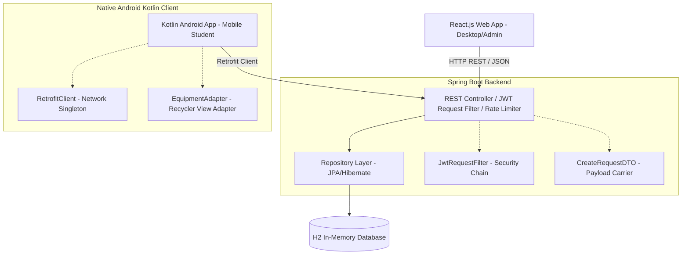

# Equipment Borrowing System - Final Project Presentation Guide

This comprehensive guide serves as your roadmap, script, and technical walkthrough template to record a stellar **5-to-10-minute Final Project Presentation** for your Systems Integration and Architecture class.

It is structured to perfectly align with your grading requirements and references the **exact technical architecture, design patterns, folder layout, and integration touchpoints** actually found in your codebase.

---

## ⏱️ Video Timing Breakdown (Target: ~8 Minutes)

| Section | Topic | Visual Focus | Timing |
| :--- | :--- | :--- | :--- |
| **1** | Self-Introduction & Hook | Slide 1: Welcome & Title | **30s** |
| **2** | System Project Introduction | Slide 2: Purpose, Problem, Goal | **1m 00s** |
| **3** | Main Features & Integrations | Slide 3: Web, Mobile, and API Highlights | **1m 30s** |
| **4** | Architecture, Component Interaction & Proof | Slide 4 & 5: System Architecture & Real Design Patterns | **2m 30s** |
| **5** | Working System Demo (Voiceover Walkthrough) | Screen Recording: Live Demo of User/Admin Flows | **2m 00s** |
| **6** | Conclusion & Q&A | Slide 6: Summary & Core Takeaway | **30s** |

---

## 📑 Part 1: Brief Self-Introduction & Title

### 📺 Slide 1: Title Slide
*   **Slide Content:**
    *   **Project Title:** Equipment Borrowing System (Web, Mobile, & REST API)
    *   **Presented By:** `[Your Name]`
    *   **Course & Section:** `[Your Course / e.g., BSIT-3A]`
    *   **Key Concept:** Real-time Multi-platform Systems Integration

### 🗣️ Spoken Script:
> *"Hello, professor! My name is `[Your Name]`, and I am a `[Your Course/Year]` student. Today, I am incredibly excited to present my final individual system project: the **Equipment Borrowing System**. This project is a fully integrated, multi-platform ecosystem comprising a Spring Boot REST API backend, a rich React web application for desktop and admin use, and a native Kotlin Android application for students on the move. Let’s dive in!"*

---

## 📑 Part 2: System Project Introduction

### 📺 Slide 2: Project Background & Context
*   **Slide Content:**
    *   **The Purpose:** Digitalize and orchestrate laboratory equipment reservations.
    *   **The Problem Addressed:** Manual paper logs are slow, prone to errors, lack accountability, and provide zero real-time inventory tracking for administrators.
    *   **Intended Users:** 
        *   *Students:* For seamless, remote browsing and reserving of IT/Media equipment.
        *   *Administrators:* For maintaining inventory, handling tickets, tracking returns, and reviewing automated reports.
    *   **The Integration Goal:** Merge Web, Mobile, and Database elements into a cohesive, secure client-server network with JWT security and enterprise design patterns.

### 🗣️ Spoken Script:
> *"At its core, the Equipment Borrowing System addresses a classic operational bottleneck in educational institutions: manual, paper-based tracking of shared equipment such as laptops, cameras, cables, and projectors. Paper records lead to double-bookings, unreturned gear, and zero accountability.*
>
> *My system automates the end-to-end lifecycle of equipment reservations. Students can instantly check real-time availability on their phones and book items. Meanwhile, administrators manage the entire stock, track penalties, review maintenance tickets, and generate CSV reports on a secure web console. The main goal of this project was to establish a secure, low-latency transaction environment connecting desktop web users, mobile app users, and a centralized relational database."*

---

## 📑 Part 3: Main Features of the System

### 📺 Slide 3: Core Capabilities & Integrations
*   **Slide Content:**
    *   🔐 **Secure Access & Auditing:** BCrypt password hashing, stateful JWT tokens, and IP-based rate limiting.
    *   📦 **Inventory Management:** Full CRUD capabilities for adding, updating, and removing hardware with real-time statuses (`AVAILABLE`, `ON LOAN`, `MAINTENANCE`).
    *   🛒 **Multi-Step Reservations:** Dynamic cart systems on both web and mobile, handling batch requests.
    *   🔧 **Maintenance Lifecycle:** Administrative ticket submission for reporting damaged items and tracking repair history.
    *   📧 **Events & Notifications:** Synchronous/asynchronous notification triggers notifying users when borrowing requests change state.
    *   📈 **Analytical Exports:** Dynamic report generation converting transaction logs into downloadable CSV sheets.

### 🗣️ Spoken Script:
> *"To achieve enterprise-ready robustness, the system implements a series of key features required in modern systems integration.*
>
> *First, we have **User Authentication and Authorization**. The backend leverages Spring Security with JWT tokens, ensuring that administrative endpoints remain locked behind role permissions while user credentials are protected via BCrypt hashing.*
>
> *Second, we support complex **CRUD operations** for inventory management and maintenance ticketing. Students can report hardware faults which administrators process via the admin dashboard.*
>
> *Lastly, we have **systems integration touchpoints**. We support multi-item cart management, transactional borrow requests, IP-based rate limiting using Bucket4j to block brute-force attempts, and automated CSV reports. Only features fully implemented and validated in our codebase are presented here today."*

---

## 📑 Part 4: System Architecture & Component Interaction

> [!IMPORTANT]
> This is a crucial segment for your grade. You must connect the architecture diagram and design pattern names to your **actual** file names in the code as **proof of implementation**.

### 📺 Slide 4: Multi-Tier Integrated Architecture Diagram

Create a diagram in your slides showing:

### 🗣️ Spoken Script:
> *"Let's look at the Architecture and Component Integration. We implement a classic **Three-Tier Client-Server Architecture**.*
>
> *On the **Presentation Layer**, we have two separate clients: our desktop React web console and our native Kotlin Android application. The Android application uses **Retrofit** as its HTTP communication client to execute network threads safely.*
> 
> *On the **Business Logic Layer**, our Spring Boot application separates concerns using a clean layered structure: REST Controllers consume JSON payloads, and spring repositories handle database mappings.*
>
> *On the **Data Layer**, we connect to an in-memory SQL database using Hibernate ORM to automatically maintain schema mappings and relationships.*
>
> *Now, let me show you how this is directly mapped to the code as **Proof of Implementation**..."*

---

### 📺 Slide 5: Code Proof & Real Design Patterns
*   **Slide Content:**
    *   **Layered Separation (Android & Backend):** 
        *   Mobile Retrofit Client: [`RetrofitClient.kt`](file:///c:/Users/pepen/Downloads/EquipmentBorrowingSystem-main/EquipmentBorrowingSystem-main/mobile/app/src/main/java/edu/cit/lastname/equipmentborrowingsystem/core/network/RetrofitClient.kt)
        *   Backend Controller: [`RequestController.java`](file:///c:/Users/pepen/Downloads/EquipmentBorrowingSystem-main/EquipmentBorrowingSystem-main/equipmentborrowingsystem/src/main/java/edu/cit/lastname/equipmentborrowingsystem/features/borrowing/RequestController.java)
    *   🛡️ **Chain of Responsibility Pattern:** [`SecurityConfig.java`](file:///c:/Users/pepen/Downloads/EquipmentBorrowingSystem-main/EquipmentBorrowingSystem-main/equipmentborrowingsystem/src/main/java/edu/cit/lastname/equipmentborrowingsystem/core/config/SecurityConfig.java) and [`JwtRequestFilter.java`](file:///c:/Users/pepen/Downloads/EquipmentBorrowingSystem-main/EquipmentBorrowingSystem-main/equipmentborrowingsystem/src/main/java/edu/cit/lastname/equipmentborrowingsystem/core/shared/JwtRequestFilter.java) implement a classic security filter chain to validate requests before they hit controllers.
    *   📦 **Data Transfer Object (DTO) Pattern:** Class objects used to safely transport request and response payloads between clients and API:
        *   Backend DTOs: [`CreateRequestDTO.java`](file:///c:/Users/pepen/Downloads/EquipmentBorrowingSystem-main/EquipmentBorrowingSystem-main/equipmentborrowingsystem/src/main/java/edu/cit/lastname/equipmentborrowingsystem/features/borrowing/CreateRequestDTO.java) & [`ApiResponse.java`](file:///c:/Users/pepen/Downloads/EquipmentBorrowingSystem-main/EquipmentBorrowingSystem-main/equipmentborrowingsystem/src/main/java/edu/cit/lastname/equipmentborrowingsystem/core/dto/ApiResponse.java)
        *   Mobile DTO: [`RequestModels.kt` (CreateRequestDTO)](file:///c:/Users/pepen/Downloads/EquipmentBorrowingSystem-main/EquipmentBorrowingSystem-main/mobile/app/src/main/java/edu/cit/lastname/equipmentborrowingsystem/features/borrowing/RequestModels.kt)
    *   🔌 **Adapter Pattern (Mobile View Adapters):** Adapts data lists into mobile views:
        *   [`EquipmentAdapter.kt`](file:///c:/Users/pepen/Downloads/EquipmentBorrowingSystem-main/EquipmentBorrowingSystem-main/mobile/app/src/main/java/edu/cit/lastname/equipmentborrowingsystem/features/equipment/EquipmentAdapter.kt) and [`CartAdapter.kt`](file:///c:/Users/pepen/Downloads/EquipmentBorrowingSystem-main/EquipmentBorrowingSystem-main/mobile/app/src/main/java/edu/cit/lastname/equipmentborrowingsystem/features/borrowing/CartAdapter.kt) adapt raw Kotlin arrays into RecyclerView lists.
    *   🧠 **Singleton Pattern:** Exists natively in Kotlin via the `object` keyword in [`RetrofitClient.kt`](file:///c:/Users/pepen/Downloads/EquipmentBorrowingSystem-main/EquipmentBorrowingSystem-main/mobile/app/src/main/java/edu/cit/lastname/equipmentborrowingsystem/core/network/RetrofitClient.kt), and in Spring via Singleton-scoped REST Beans (e.g. `AuthController.java`, `RateLimitingService.java`).
    *   🚀 **Builder / Factory Pattern:** Constructing the network layer using `Retrofit.Builder()` and `OkHttpClient.Builder()` inside [`RetrofitClient.kt`](file:///c:/Users/pepen/Downloads/EquipmentBorrowingSystem-main/EquipmentBorrowingSystem-main/mobile/app/src/main/java/edu/cit/lastname/equipmentborrowingsystem/core/network/RetrofitClient.kt).
    *   💤 **Lazy Initialization Pattern:** Initializing resources on-demand (`by lazy` delegate) to preserve system memory in [`RetrofitClient.kt`](file:///c:/Users/pepen/Downloads/EquipmentBorrowingSystem-main/EquipmentBorrowingSystem-main/mobile/app/src/main/java/edu/cit/lastname/equipmentborrowingsystem/core/network/RetrofitClient.kt).

### 🗣️ Spoken Script:
> *"Here is concrete proof of the architectural patterns in my actual source code.*
>
> *First, for client-server communication: In my Android application, **RetrofitClient.kt** registers network singletons for AuthService, EquipmentService, and RequestService. The backend listens at **RequestController.java** using Spring's Rest Mapping annotations.*
>
> *Second, we implement classic enterprise-level integration patterns to decouple our systems:*
> 1. *The **Chain of Responsibility Pattern** in **SecurityConfig.java** and **JwtRequestFilter.java** coordinates security checkpoints through a sequential servlet filter chain.*
> 2. *The **Data Transfer Object (DTO) Pattern** carries strict schemas between clients and endpoints. Examples include **CreateRequestDTO.java** on the backend and **RequestModels.kt** on our Android mobile client.*
> 3. *The **Adapter Pattern** is leveraged in our mobile front-end using **EquipmentAdapter.kt** and **CartAdapter.kt** to adapt raw domain lists into Android UI RecyclerView items.*
> 4. *The **Singleton Pattern** is defined natively in Kotlin using the thread-safe `object` declaration in **RetrofitClient.kt**, while our REST controllers are managed as Singletons by the Spring IoC container.*
> 5. *Finally, we leverage **Builder** and **Lazy Initialization** patterns in our networking module to safely spin up HTTP instances only when required, keeping our memory footprint low."*

---

## 📑 Part 5: System Demonstration with Voice-Over

### 🎥 Step-by-Step Demo Flow:

#### 1. Registration & Security check (Web / Mobile)
*   **Action:** Show the Login page. Try logging in with a bad password (demonstrate rate-limiting & 401 response). Register a new student account.
*   **Dialogue:** *"Here, I am opening the login interface. The system uses BCrypt password validation. I'll login as `jonas@citu.edu` using the secure seeded credentials. We successfully retrieve our JWT access token, which is stored securely to authorize all subsequent REST requests."*

#### 2. Browsing & Mobile Cart flow
*   **Action:** Open your React catalog or Android simulator. Show the dynamic list of equipment retrieved directly from the database seeder (`MacBook Pro`, `Dell XPS`, `Canon Camera`). Add items to the cart.
*   **Dialogue:** *"I will now browse the real-time catalog. The items you see are pulled dynamically from the database seeder running on our Spring Boot API. When I add this MacBook Pro to my cart and hit borrow, the client makes a POST request to `/api/v1/requests` carrying the request DTO. The backend processes this, logs the borrow action, and transitions the item's status to ON LOAN."*

#### 3. Administrative Control & Maintenance (Web)
*   **Action:** Log into the Admin panel (`admin@citu.edu`). Show the inventory management view, create/view a maintenance ticket for a faulty PC/camera, and click **Export Report** to download the CSV.
*   **Dialogue:** *"Now switching to the Admin perspective on our React Web panel. As an admin, I can view our live dashboard of requests, manage our inventory, and check maintenance tickets. If I need a physical copy of our logs, I can hit Export. The backend controller filters the data and triggers a direct file download stream to save our transaction log as a CSV."*

---

## 📑 Part 6: Conclusion

### 📺 Slide 6: Summary & Core Takeaways
*   **Slide Content:**
    *   **Achieved Integration:** Seamless data exchange between Kotlin Android Client, React Web App, and Spring Boot API.
    *   **Technical Integrity:** Role-based JWT security, Bucket4j rate limiting, in-memory transactional database.
    *   **Design Cleanliness:** Clean architectural boundaries via layered Separation of Concerns and core design patterns (Singleton, Adapter, DTO, Filter Chain, Builder).
    *   **Thank you!** Questions & Feedback.

### 🗣️ Spoken Script:
> *"In summary, the Equipment Borrowing System demonstrates a robust, enterprise-grade integration. By connecting React web interfaces and mobile Android clients to a secure Spring Boot API, we have eradicated operational delays, brought full transparency to school laboratories, and adhered to clean-coding practices through classic software design patterns.*
>
> *Thank you very much for your time and guidance throughout this semester. I am open to any feedback or questions you may have about my implementation. Thank you!"*

---

## 💡 Quick Tips for Recording a High-Score Video:
1.  **Reduce Resolution:** Set your screen recording to `1080p` at `30fps` so text in code files and web interfaces is crisp and easy to read.
2.  **Zoom In on Code:** When showing files like `RetrofitClient.kt` or `RequestController.java`, zoom in to `150%` so your teacher can read the class declarations clearly.
3.  **Prepare Tabs:** Have your H2 Database Console (`http://localhost:8080/h2-console`), React Frontend (`http://localhost:5173`), and your Android simulator open and logged in beforehand to save time.
4.  **Confirm Link Sharing:** When uploading your video link to Google Drive/OneDrive, set the link settings to **"Anyone with the link can view"** so your instructor can grade it without requesting access!
